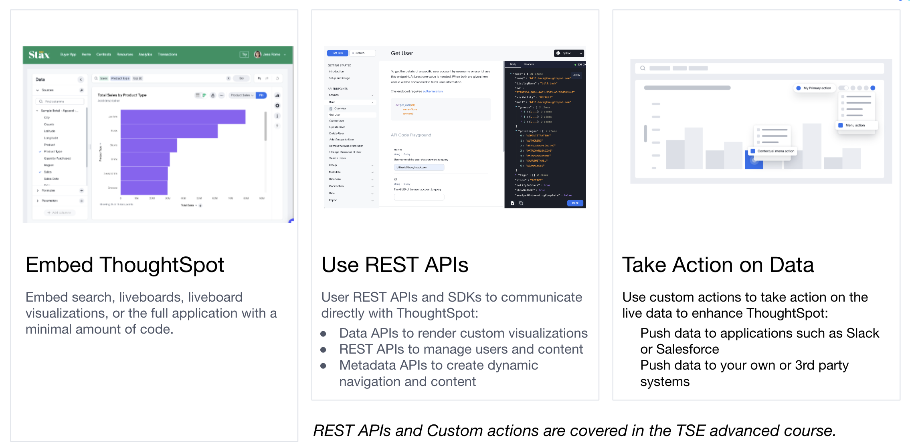
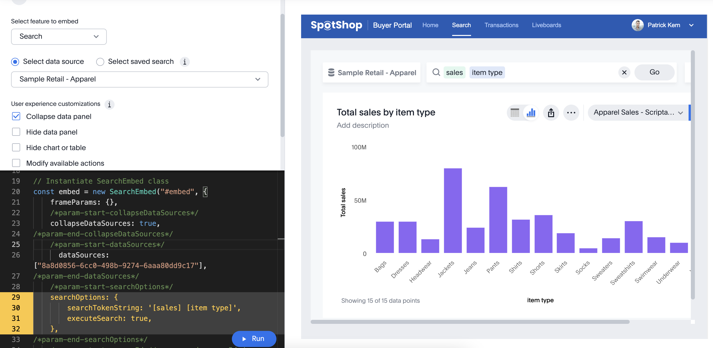

# Lesson 1: Introduction to ThoughtSpot Everywhere

In this lesson we are going to cover the following:

* What is ThoughtSpot Everywhere and why should you use it?
* The developer and administrator role in ThoughtSpot.

## What is TSE and why should you use it?

ThoughtSpot Everywhere (aka TSE) is an umbrella term for the ability to embed ThoughtSpot capabilities into your applications.  "Embed" includes visual components, such as embedded search, API calls, and the ability to push TS data to other applications.  

ThoughtSpot has the following benefits:

* Provide more than static dashboards with the full power of ThoughtSpot - users are able to explore, drill anywhere, and interact with data to answer the next question they have without relying on analysts to create new reports and dashboards.
* Minimal coding to embed ThoughtSpot using our Visual SDK and Developers Playground - developers can generate code that can be copied directly into applications and then tweaked for dynamic behavior.  Concept to embedding takes minutes, not days.
* Analysts create analytics, developers create software - with TSE there's no long requirements cycle for dashboards where an analyst defines the requirements, developers code, and the review cycle begins.  Analysts create content and developers simply embed.
* Empower users to explore their own data and then take action on the results - not only can users ask questions of data, but with Custom Actions and ThoughtSpot sync, users can send the data to other applications and targets, allowing you to fully operationalize your analytics.  

## The developer and admin role

There are two important roles to understand when developing with ThoughtSpot Everywhere.  The first role is the __Developer__, who has access to the Developer's portal in the UI.  This portal provides documentation, settings, and Playgrounds for generating visual embed and REST SDK code.  The Developer portal is what makes it so easy to work with ThoughtSpot Everywhere.

The __Admin__ role, has the same privileges as the Developer, but can also modify security settings and create users and groups.  Typically, most developers will have the Developer role and will work with an administrator to set up security.

## Activities

1. If you don't have one, create a [ThoughtSpot Account](https://www.thoughtspot.com/trial).  This account will need Developer (and possibly Admin) privileges.

[next](lesson-02-setting-up/README-02.md)