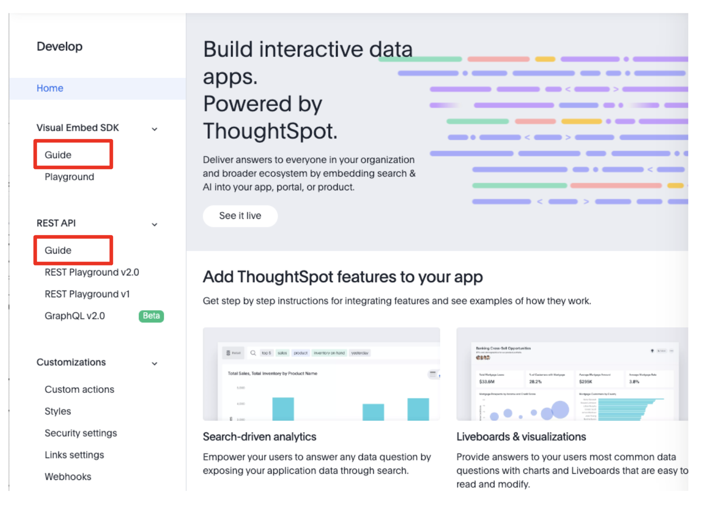
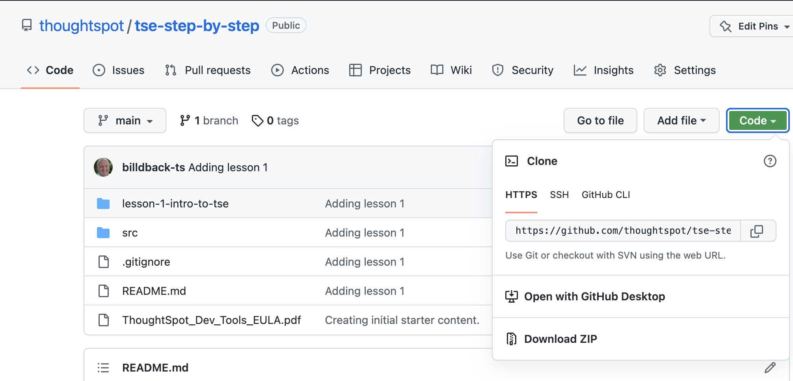

# Lesson 2: Setting up for the course

## Pre-conditions

You should also have a ThoughtSpot developer account with TSE enabled.  If you didn't already create an account, you can create a [trial account](https://www.thoughtspot.com/trial) that's good for 30 days and has TSE enabled.  

You will also need the following:

* A modern web browser.  We'll use Chrome in the examples, but you should be able to use other browsers like Safari or Edge.
* A text editor for editing code.  You can use any text editor, but an IDE that support HTML, CSS, and Javascript will work better.  The examples in this course use PyCharm, a popular IDE for Python and web development.
* A web server to run the code.  You can use any web server that will serve static content.  The examples will use the Python3 [http.server](https://docs.python.org/3/library/http.server.html) which is a lightweight server userful for development.

## Review the TSE documentation

ThoughtSpot provides detailed documentation on embedding and the SDK.  There are two places you can get the documentation.  First, you can use the documentation from the developer site: [https://developers.thoughtspot.com/docs](https://developers.thoughtspot.com/docs)

The second location is in the ThoughtSpot Develop tab.  The image below shows the links to the documentation for the visual embed SDK Guide and the REST API Guide.  

## Become familiar with the playground

Click the Playground link in the develop tab under "Visual Embed SDK" (see the image above) and you will open the Playground.  The playground is an area that lets you quickly and easily generate working code that you can embed into your application.  The following image shows an example using a search embed.  

The image above has three main sections:

1. The first section shows the running code.  As you make changes and run the code you get to see the results.  This is what the code would look like in your application (ignoring any style differences).  This is a great benefit to using the playground, because error will also show up.
2. The second section allows you to choose different options.  At the top is a dropdown that lets you specify the type of content you are embedding.  The options below the dropdown differ based on the content selected.  
3. The third and final section is the code that is being run.  This code is interactive and can be modified and then run using the (Run) button.  The code can be updated using the selections in section two or by modifying the code directly.  The code section has smart code completion that can help enter the appropriate values.

## Download the code

Before beginning, you should download the code from GitHub.  The recommended approach is to use the [`git clone`](https://github.com/git-guides/git-clone) command to make a local copy, perhaps after [forking](https://docs.github.com/en/get-started/quickstart/fork-a-repo) the code base.  If you don't want to take this route (or don't know what those commands are), then you can also just download the code using the Download Zip option as shown in the image below.

## Activities

1. Explore the documentation site.
2. Log in as a Developer and explore the Develop tab.
3. Open the Visual Embed SDK Playground and modify content and run the resulting code to become familiar with the code. 
4. Download the code or clone the repository.  
