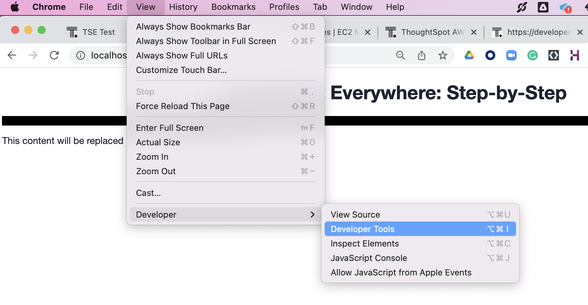
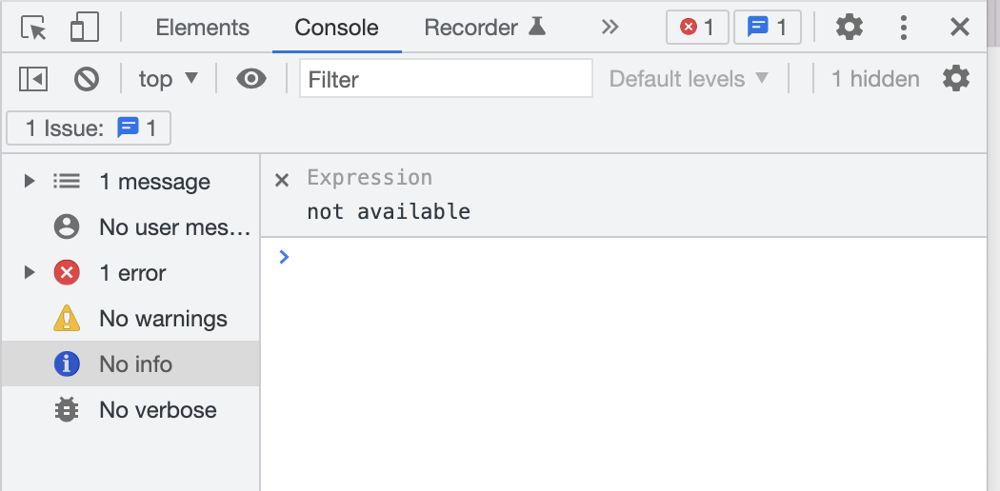

# Lesson 4 - Start Coding

Now that we've got everything (hopefully) set up, it's time to dig into the code we'll be modifying.  In this lesson we'll create a copy of the code, so we can modify it, take a look at the files, and then start the web server to make sure everything is working fine.

## Pre-Conditions

You should have done the activities in the previous lessons.  In particular:
* Download the GitHub source code.
* Have a ThoughtSpot account with Developer privileges.
* Have configured the security settings to be able to embed.

It's at this point you'll also need an editor such as an IDE or a text editor, ideally one that will support JavaScript and HTML formatting.  The examples here use Sublime Text, a popular text editor, but you can use any editor as long as you can edit text files.

## Make a copy of the code

You can work directly in the code you downloaded from GitHub, but it's usually better to create a copy, so you can always revert if you run into problems (or you can just download again).  Which path you chose to take is entirely up to you.  

Which ever approach you take, you should end up with a folder with the files shown below.

## Review the main files

We won't go into all the files yet.  The apis and images folders we can address later in the course.  The three main files for the application are index.html, tse.css, and tse.js.

### index.html

This is a standard HTML page and will serve as the primary page for the application.  We'll just embed everything into the resulting document object model (DOM).  This file will only be used to define the content of the application.  The layout and dynamic portions of the application will be done in the CSS and JS files.  

A few sections of this file are worth looking at:

The first section creates a div for a modal box.  The resulting modal will have an x, so we can close it.  By default, this modal is going to be hidden.  We'll show and hide it using CSS properties.  It's hidden to start with.

~~~

    

        &times;
        

    

~~~

The second section of interest is the div for showing navigation links.  We'll add new links
as we add functionality to the code.  This will be the only updates to the HTML file that we'll do.

~~~

    <ul id="ul-nav-links">
    </ul>

~~~

Possibly the most important section is the div with the `id=embed`.  This div will be used to tell the TSE SDK where to render content.  The ID can be any value, but it must match the ID we use when embedding.  `embed` is common because it matches the ID generated in the Developer Playground.  Note that you can have more than one section for embedding.

~~~

    
This content will be replaced by your embedded content.

~~~

Finally, we import the `tse.js` file as a Javascript module.  We are using the ES6 version of JavaScript that supports modules.  This version is supported in all modern browsers.  

~~~

~~~

The remainder of the file includes HighCharts links for a custom chart we'll be creating in a later section.

### tse.css

The CSS file controls the look and feel as well as the layout of the application.  We'll also use style modification to show and hide items.  We won't be modifying the CSS file as part of this project, but it's worth looking at the definitions, especially `#embed` and `.modal*` classes.

### tse.js

The final file to look at right now is the one we'll be modifying the most.  `tse.js` contains the application logic that makes the application work.  Initially this file is pretty sparse, but we'll be adding functions to it as we go.  

The first section imports some components from the SDK.  The .es.js at the end indicates it's the version for ES6.  There's also a plain vanilla version without the .es as well as a npm install.

~~~
import {
  init,
  AuthType,
} from 'https://unpkg.com/@thoughtspot/visual-embed-sdk/dist/tsembed.es.js';
~~~

The next section defines the `tsURL` to indicate the server you are connecting to.  It's not technically required, but it avoids hard coding the value everywhere it's needed.  You should change this to be the value of the ThoughtSpot server you are using.

`const tsURL = "https://myx.thoughtspot.cloud";`

The next section of code, the `loadApp` function will be called when the window is loaded (see the last line of the file).  This is where we'll put the initialization code for the application.  

Finally, there are help functions that will be used to clear content and close the modal box.  These will be used as we build the application.

## Start the Web Server

Now that we've reviewed the relevant files, it's time to start the web server and make sure everything is working.  You can use any web server, but in this course, we'll use the `http.server` module from Python 3.  

You must run this command in the folder where the code is located.  

You'll just type the command below depending on your version of Python and your environment.  Most (but not all) systems now have Python 3 by default, but the following almost always work.

Windows:  `python -m http.server 8000`
Mac and Linux: `python3 -m http.server 8000`

Your environment may be different.  If you get an error saying the module isn't found, then you should run `python --version` and verify you are using a Python3 version.

The following image shows my environment.  

1. I'm in the ~/Downloads/tse-step-by-step folder, which is where I put the copy of the starting source code.  
2. You can see (from the `ls`) that I'm in the folder with the code.  
3. Next, I checked my version of Python (3.8.2), which means I can just use the `python` command. 
4. Finally, I started the web server on port 8000, and I get a message that it's running.  You don't have to use port 8000, but make sure the correct port is set in the security settings discussed in [Lesson 3](/lesson-03-security-setup/README-03.md)

## View the page in the browser

Finally, let's make sure the page can load.  Open your web browser (examples are all in Chrome) and go to `http://localhost:8000`.  You should see something like the image below.  If you see a list of files, it usually means you started the webapp in the wrong folder.

## Open dev tools and disable the cache

Finally, you should open the developer tools in your browser.  From Chrome, you can open from the menu item for View -> Developer -> Developer Tools.  There are also shortcuts for different operating systems.  

You should see a panel like the following, though yours may be on a different tab.  For me, it opened in the Console view, where you can see errors, warnings, and general info messages.

From there, you should open the Network tab and make sure the `Disable cache` box is checked.  Failure to do this step may cause you to not see updates to your code as you make them.  You need to keep the developer tool window open, though you can make it smaller and move it. 

At this point, you should be ready to start adding content.

## Activities

1. Make a copy of the code in a new folder where you will do your work.
2. Modify the tsURL value to be the URL for your ThoughtSpot instance.
3. Start the web server.
4. Open the application in a browser.
5. Open the developer tools and disable the cache.

[< prev](../lesson-03-security-setup/README-03.md) | [next >](../lesson-05-embed-search/README-05.md)
