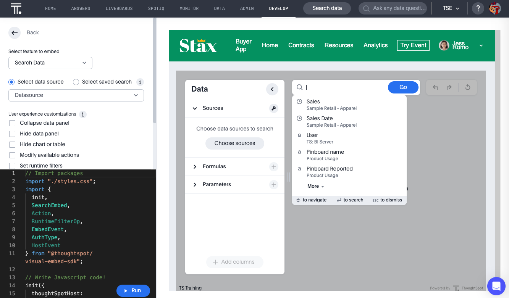
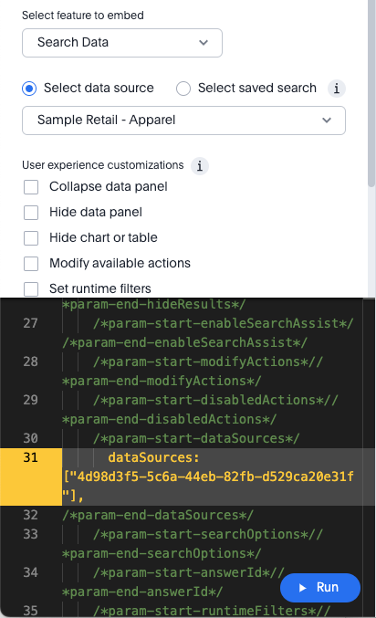

# Lesson 5 - Init and Embed Token Search

At this point we are ready to start embedding ThoughtSpot content. In this lesson we'll initialize the SDK and embed a
search page. To make it quick and easy, we'll use the developer's playground to generate the code and then update our
HTML and JS files to use the generated code.

## Pre-Conditions

If you've done the steps in the previous sections, you should have a copy of the code and be able to run it and view the
empty application in a web browser. If not, please revisit previous lessons to get set up.

## Add a nav link and function for the search

First we want to add a nav link to be able to run the search embed. In the `index.html` file add a new `<li>` for the
search page. Your code should look like the following. The link needs to have an ID to add a listener.

~~~

  <ul id="ul-nav-links">
    <li id="search-link">Search</li>  <!-- lesson 05 -->
  </ul>

~~~

Now run the application, and you should see the Search link show up. It doesn't do anything yet, but it's always good to
test code as we add functionality to find errors quickly.

## Add a listener for the search link

In `tse.js` add the following line of code. It adds a listener for the click event, so when the user clicks, it will
call the `onSearch` function. Put this function in the section that begins with `Events for nav bar` towards the bottom
of the file.

`document.getElementById('search-link').addEventListener('click', onSearch);`

Now we have to add an onSearch function to get called. After the close of the `loadApp` function, add the following
function. Right now it only shows a comment in the console, but that will tell you that it's being called.

~~~
const onSearch = () => {
  console.log('searching');
}
~~~

Refresh the application and click on the Search link. You should see a message in the console window of the developer
tools. If not, check for errors. You can also reference the example code (in the src folder).

## Call init

Before we can embed the search, we have to initialize the SDK. Initializing the SDK tells it the ThoughtSpot instance to
talk to and the type of authentication. There are additional parameters you can pass as well that we won't cover in this
session, but you can read about them in
the [documentation](https://developers.thoughtspot.com/docs/?pageid=getting-started#initSdk).

One particular parameter that you should consider is to use
the [callPrefetch](https://developers.thoughtspot.com/docs/?pageid=prefetch) parameter and set it to true. This will
make the first embed object load faster since static content has been already cached locally. Note that this won't do
anything if we have caching disabled for development, but it has a big impact in production usage.

For a basic `init` call, the code is simple. Put this code in the `loadApp` function. Let's also go ahead and set the
embed to tell the user to select a link. You should end up with something like the following. In this case `tsURL`
refers to the constant defined above, e.g. `const tsURL = "https://myx.thoughtspot.cloud";`.

The final version of loadApp should look like the following.

~~~
const loadApp = () => {
  init({
    thoughtSpotHost: tsURL,
    authType: AuthType.None
  });

  document.getElementById("embed").innerHTML = "
Select an option from above.
";
}
~~~

## Generate a search to embed

While you _can_ view the documentation and create an embed, it's much easier to use the developer's playground. To open
the playground do the following:

* Log into ThoughtSpot as a developer
* Click on the Develop tab at the top of the screen
* Select the Playground option under Visual Embed SDK on the left

You will get a screen that look like the following, but with default values. We'll set the values to creat a chart
in a bit.

The playground is made up of three sections:

* On the right is the running embed. This section shows what the results of the embed will look like in your code. The
  area in light grey is the embed area.
* On the top left you see an option for selecting components and their properties. In this case the dropdown is set to
  Search Data since we are embedding search. Beneath that there are different properties that are specific to the embed
  search component.
* Finally, on the bottom left is the actual code that will run. This code can be edited in ThoughtSpot and will be
  updated automatically as you change values at the top.

The sections make up a working environment that will let you generate, modify, and test your embed component before
putting them into your application. Using the playground can reduce errors and save time.

Let's first look at the setting we can set, and then set a few.

* The data source / saved search radio button and dropdown let you select a data source (usually a worksheet) or an
  already created answer to embed. The search embed component is used for both.
* Below that are sets of checkboxes to enable or disable different features. As you check the boxes you will see the
  code in the bottom update. Updates are shown in yellow/orange.

Let's create the search component we want to embed.

1. Select a data source from the dropdown. You should see the code update with the GUID for the data source. You may
   notice that it adds a list item. You can technically add multiple data sources, but the playground only supports
   adding one at a time.

2. Click on the `Collapse data panel`. This setting causes the data panel to be collapsed rather than showing. The user
   can click on the name of the data source and expand it back out if they want.
3. Click on `Add search tokens`. You will get code added for the search options. These options require a TML search
   string. The TML search string has a more structured format than search. In particular, search tokens have brackets
   for column names. I've added the following search that will include the `sales` and `product type` columns. Yours
   will look similar, but the search string will depend on the source. The `executeSearch` flag simply tells the SDK if
   the search should run automatically or if the user needs to click `Go`.

~~~
searchOptions: {
  searchTokenString: '[sales] [product type]', //write a TML query
  //[commit date][revenue]
  executeSearch: true,
},
~~~

4. Finally, let's restrict some available actions. Actions are the options in the menu and icons that a user can click
   to
   do something, such as sharing, downloading, etc. The actions can be controlled by disabling them (greying out, but
   leaving visible), hiding them (removing from the menu) or specifying those that are visible. Note that you can
   specify the ones that are hidden or visible, but not both.

Click the checkbox for `Modify available actions` and then set the actions appropriately. The following example shows
disabling the download action and hiding the share action. If you just start typing `Action.` the editor will give you a
list of action values.

~~~
disabledActions: [Action.Download],
disabledActionReason: "Permission required",
// visibleActions: [], /* Removes all actions if empty array */
hiddenActions: [Action.Share],
/* Use either visibleActions or hiddenActions */
~~~

Go ahead and hit the `Run` button, and you should see a search similar to the image above. If not, go ahead and make
changes. Remember, you can't break anything and the playground will give you an error message if your embed code isn't
correct.

## Embed the search into the application

Now that we've created the embed component using the playground, it's an easy matter to put it into our `onSearch`
function. All embed components require two steps:

1. Create the embed object using SearchEmbed, LiveboardEmbed, etc.
2. Render the object (with optional event listeners).

The benefit to splitting out the creation of the component from the rendering of the component is that you can create
multiple components and then render based on the user's behavior, such as selecting a link from a menu.

First copy the following from the playground and paste into the `onSearch` function _after_ the `console.log` statement.
Note that generated comments have been removed and that your `dataSources` id will be different.

Also, you _must_ change the ID!  In this case, replace `#your-own-div` with `#embed` to match the DIV id
from `index.html`.

~~~
const embed = new SearchEmbed("#embed", {
    frameParams: {},
    collapseDataSources: true,
    disabledActions: [Action.Download],
    disabledActionReason: "Permission required",
    hiddenActions: [Action.Share],
      dataSources: ["4d98d3f5-5c6a-44eb-82fb-d529ca20e31f"],
    searchOptions: {
        searchTokenString: '[sales] [product type]', 
        executeSearch: true,
    },
});
~~~

Now that the component is created, we need to render it. That just requires the following line of code. You could copy
it from the playground, but the playground adds event listeners that we don't need, so it's easier to just add it.

`embed.render();`

The completed `onSearch` should look something like the following.

~~~
const onSearch = () => {
  const embed = new SearchEmbed("#embed", {
    frameParams: {},
    collapseDataSources: true,
    disabledActions: [Action.Download],
    disabledActionReason: "Permission required",
    hiddenActions: [Action.Share],
    dataSources: ["4d98d3f5-5c6a-44eb-82fb-d529ca20e31f"],
    searchOptions: {
      searchTokenString: "[sales] [product type]",
      executeSearch: true,
    },
  });

  embed.render();
};
~~~

## Test search embed

The last step is to test the embedded search. Simply refresh the application (with cache disabled), then click the
Search link, and you should see something like the following:

## A note on loading times

You will likely notice that the search takes a long time to render. The initial rendering will re-download the
ThoughtSpot content from ThoughtSpot. This delay can be significantly sped up by using `callPrefetch: true` in
the `init` method. If you have caching disabled it will always re-download.  Prefetch and caching will speed this up.

## Activities

1. Add the nav link and handler to your code
2. Import the SearchEmbed, Action, and EmbedEvent components to the import section
3. Add the init method (copy from playground or just write)
4. Use the playground to create a search embed component
5. Copy the search embed component from the playground to your code and modify the DIV ID
6. Add a render() call
7. Test the code

If you run into problems, you can look at the code in the `src` folder in this section.

## Files changed

* index.html
* tse.js

[< prev](../lesson-04-start-coding/README-04.md) | [next >](../lesson-06-embed-sage/README-06.md)
