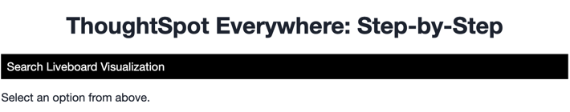
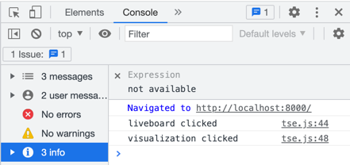
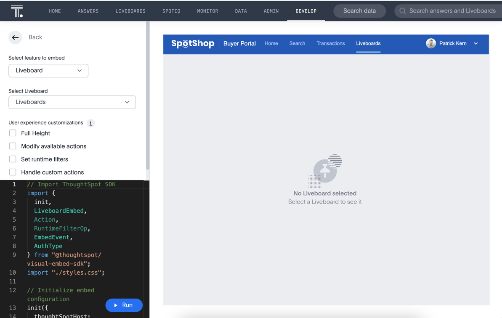
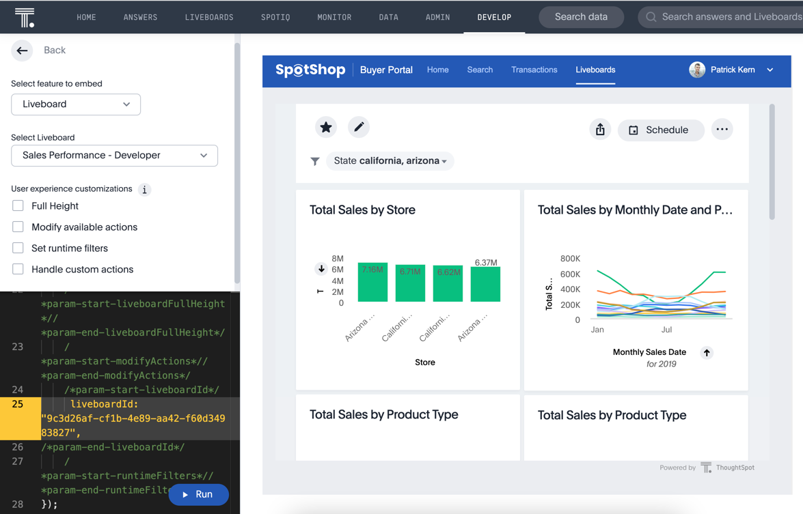
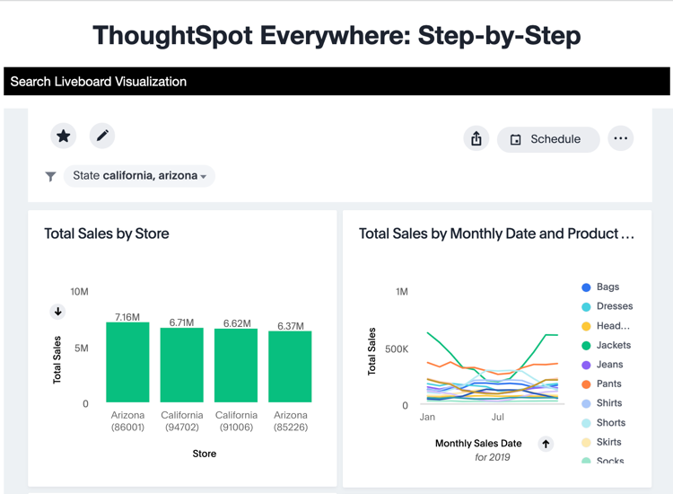
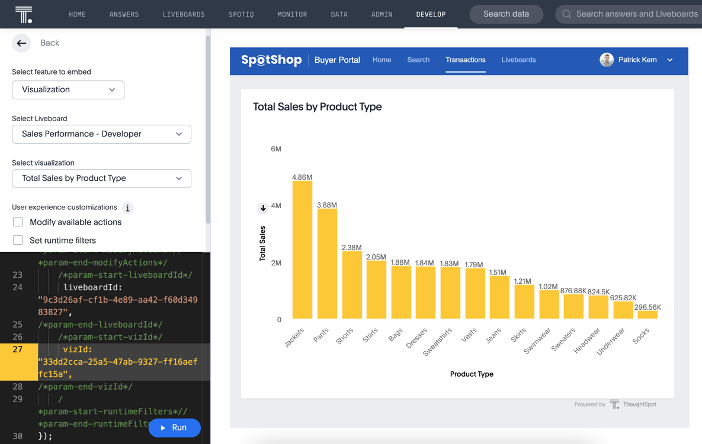
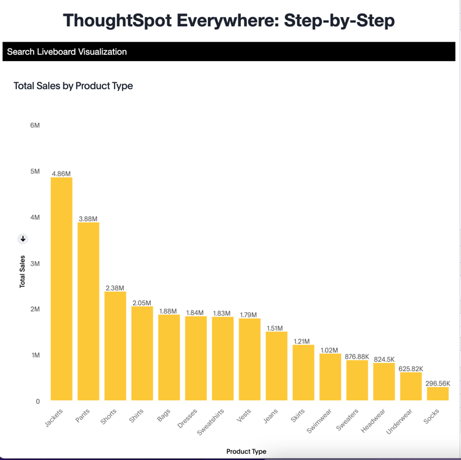

# Lesson 6 - Embed Liveboards and Visualizations

Now that you've already embedded a search, you will that the rest of the embedding follows the same basic pattern:
* Create the component in the playground
* Add the component to your code and render

In this lesson we'll embed a liveboard and a liveboard visualization.  In the same manner that `SearchEmbed` can be used to embed a search component or a saved answer, the `LiveboardEmbed` component can do entire liveboards or a specific visualization from the liveboard.

## Pre-Conditions

It's ideal if you've done all of the lessons so far.  You minimally will need to have set up the environment and code and have an `init` method working (see [lesson 06](../lesson-06-embed-liveboard/README-06.md)).

## Add a nav link and function for the search

First we want to add two nav links to the nav bar.  In the `index.html` file add a two new `<li>` for the livboard and visualiation.  Your code should look like the following.  The links needs to have an ID to add a listener.

~~~

  <ul id="ul-nav-links">
    <li id="search-link">Search</li>
    <li id="liveboard-link">Liveboard</li>
    <li id="visualization-link">Visualization</li>
  </ul>

~~~

Now run the application and you should see the new links.  It doesn't do anything yet, but it's always good to test code as we add functionality to find errors quickly.  The UI could use some style work to make it easier to read, but this layout is sufficient to learn TSE.

## Add a listener for the liveboard links

In `tse.js` add the following lines of code.  It adds a listener for the click events, so when the user clicks, it will call the `onLiveboard` or `onVisualization` function.  Go ahead and add this line after the one we added for the `search-link`.

~~~
document.getElementById('liveboard-link').addEventListener('click', onLiveboard);
document.getElementById('visualization-link').addEventListener('click', onVisualization);
~~~

Now we have to add the functions to get called.  After the close of the `onSearch` function, add the following functions.  Right now they only shows a comment in the console, but that will tell you that it's being called.

~~~
const onLiveboard = () => {
  console.log('liveboard clicked');
}

const onVisualization = () => {
  console.log('visualization clicked');
}
~~~

Refresh the application and click on each link.  You should see a message in the console window of the developer tools.  If not, check for errors.  You can also reference the example code (in the src folder).

## Add the LiveboardEmbed to the import

In order to use the `LiveboardEmbed` component, we need to import it.  At the top of the file, add LiveboardEmbed to the list of components.  You should now have an import like the following:

~~~
import {
  init,
  AuthType,
  SearchEmbed,
  LiveboardEmbed,
  Action,
} from 'https://unpkg.com/@thoughtspot/visual-embed-sdk/dist/tsembed.es.js';
~~~

## Generate a liveboard to embed

The same way you created a `SearchEmbed` component in the playground, we'll create a liveboard embed.  Navigate to the visual embed SDK playground and select "Liveboard" from the dropdown on the top left.  You should see something like the following.  While search will show search page, the liveboard doesn't have a default view.  

The `LiveboardEmbed` doesn't have a lot of options.  In addition to the Liveboard to embed, you can specify the following:
* Full height - if set, this feature will cause the header to scroll up and down
* Modify available actions - allows you to manage what actions are displayed
* Set runtime filters - you can set (and update) runtime filters on the liveboard without a user selecting them
* Handle custom actions - Allows you to handle custom actions (discussed in a future lesson)

Let's create the liveboard component we want to embed.  In this case, you just need to specify a liveboard from the dropdown.  We'll just use the defaults for the other values.

Select a liveboard from the dropdown and you should see a `liveboardId` added to the code.  Click run and you should see your liveboard show up in the right-hand panel.

## Embed the liveboard into the application

As with search we'll just copy the code from the playground into the application.  Copy the component creation section.  It will look like the following.  Comments have been removed.  Paste this code into the `onLiveboard` function.

~~~
const embed = new LiveboardEmbed("#embed", {
  frameParams: {},
  liveboardId: "9c3d26af-cf1b-4e89-aa42-f60d34983827",
});
~~~

Now we just need to render the component so it shows up.  Failure to add this step results in an empty embed area.

`embed.render();`

The completed `onLiveboard` should look something like the following.

~~~
const onLiveboard = () => {
  console.log('liveboard clicked');

  const embed = new LiveboardEmbed("#embed", {
    frameParams: {},
    liveboardId: "9c3d26af-cf1b-4e89-aa42-f60d34983827",
  });

  embed.render();
}
~~~

## Test the liveboard embed

The last step is to test the embedded liveboard.  Simply refresh the application (with cache disabled), then click the `Liveboard` link and you should get something like the following:

## Generate a liveboard visualization to embed

Liveboard visualizations embed components are created the same way as liveboards.  Go back to the playground and instead of selecting `Liveboard` from the dropdown, select `Visualization`.  Now you get two dropdowns, one for the liveboard and one for the visualization.  Select a liveboard from the dropdown list and then select a visualization from that dropdown list.  

Note that the other options for a visualization are the same as for a for the liveboard.  That's because they both use the `LiveboardEmbed` component.  The only difference is the presence of a `vizId`.

Click the run button, and you will see a populated visualization. 

## Embed the visualization into the application

Now we just need to copy the code from the playground.  Copy the component creation code, which should look like the following:

~~~
const embed = new LiveboardEmbed("#embed", {
  frameParams: {},
  liveboardId: "9c3d26af-cf1b-4e89-aa42-f60d34983827",
  vizId: "33dd2cca-25a5-47ab-9327-ff16aeffc15a",
});
~~~

Finally, add the render so the visualization will be displayed.

`embed.render();`

The completed `onVisualization` should look something like the following.

~~~
const onVisualization = () => {
  console.log('visualization clicked');

  const embed = new LiveboardEmbed("#embed", {
    frameParams: {},
    liveboardId: "9c3d26af-cf1b-4e89-aa42-f60d34983827",
    vizId: "33dd2cca-25a5-47ab-9327-ff16aeffc15a",
  });

  embed.render();
}
~~~

## Test the visualization embed

The last step is to test the embedded visualization.  Simply refresh the application (with cache disabled), then click the `Visualization` link, and you should get something like the following:

## Activities

1. Add the nav links and handlers to your code
2. Import the LiveboardEmbed component
4. Use the playground to create the embed components
5. Copy and paste the generated code (adding render()) into your application
6. Test the code

If you run into problems, you can look at the code in the `src` folder in this section.

## Files changed

* index.html
* tse.js

[< prev](../lesson-05-embed-search/README-05.md) | [next >](../lesson-07-embed-full-app/README-07.md)
