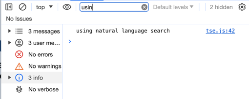
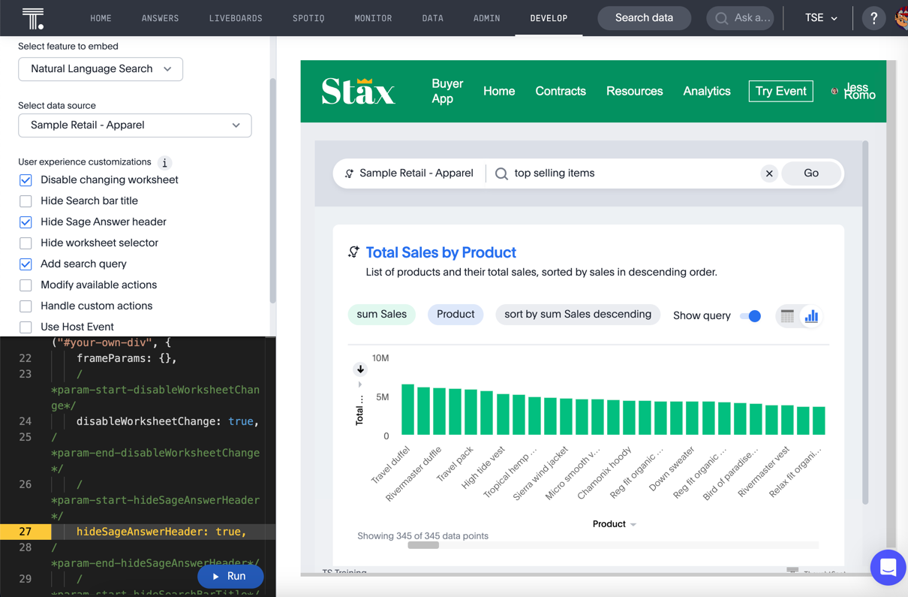
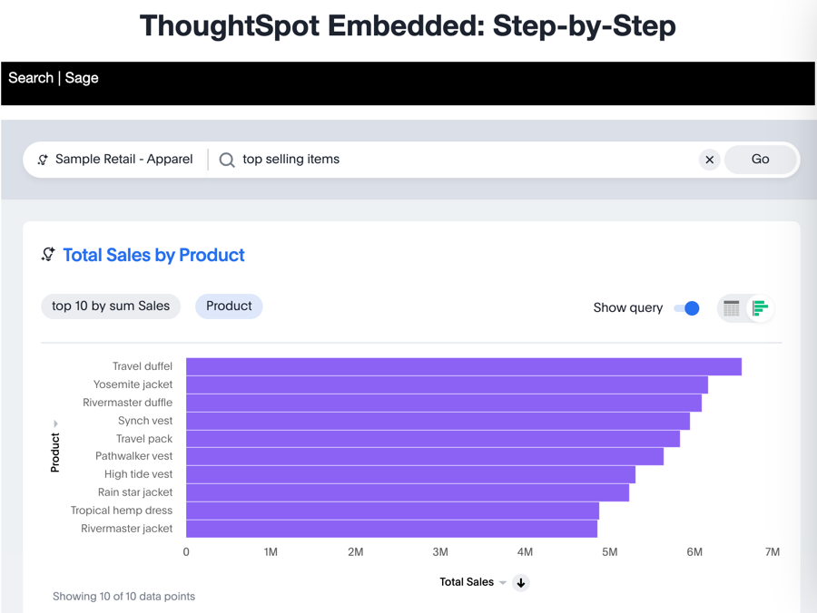

# Lesson 6 - Embed Natural Language Search

In this lesson we'll be adding Natural Language Search (also known as Sage) to the embedded application. This is a newer
feature that was added in version 9.8.

## Pre-Conditions

You should have already successfully completed all the lessons
through [lesson 5](../lesson-05-embed-search/README-05.md).

## Add a nav link and function for the natural language search

First we want to add a nav link to be able to run the sage embed. In the `index.html` file add a new `<li>` for the
natural language search page. We'll also a pipe character `|` as an item to provide a separator character in the menu.
Your code should look like the following:

~~~

    <ul id="ul-nav-links">
        <li id="search-link">Search</li> <!-- lesson 05 -->
        <li>|</li>
        <li id="sage-link">Sage</li>  <!-- lesson 06 -->
    </ul>

~~~

Now run the application to verify everything is working. You should see the Search link show up.

## Add a listener for the search link

In `tse.js` add the following line of code. It adds a listener for the click event, so when the user clicks, it will
call the `onSage` function. Put this function this after the listener we added in the previous lesson. The event
listener section should now have two listeners being registered.

~~~
document.getElementById("search-link").addEventListener("click", onSearch);
document.getElementById("sage-link").addEventListener("click", onSage);
~~~

Now we have to add an onSage function to get called. After the close of the `onSearch` function, add the following
function. Right now it only shows a comment in the console, but that will tell you that it's being called.

~~~
const onSage = () => {
  console.log('using natural language search');
}
~~~

Refresh the application and click on the Search link. You should see a message in the console window of the developer
tools. If not, check for errors.

## Generate a natural language search to embed

If you are not already in the Visual SDK playground, navigate there and select Natural Language Search from the dropdown
menu. You should see an empty Sage search like the following:

Let's review the Sage specific settings and set a few.

* The `Select data source` dropdown is similar to what we used in the Search embed. It will show any worksheets that
  have been enabled for natural language search. Select one from the dropdown. You should now see code added in the code
  section. Note that unlike the Search embed, you can only have one data source at a time, so it's not a list.

Let's create the search component we want to embed.

First, select a data source from the dropdown. You should see the code update with the GUID for the data source. You may
notice that it adds a list item. You can technically add multiple data sources, but the playground only supports
adding one at a time. Unlike with Search embed, you also _always_ need a data source for Sage search, though it can be
provided by the user.

Next, we can select some of the different Sage specific options:

* Disable changing worksheet. If you pre-selected a data source, then you can select this option to disallow changing
  it.
* Hide Search bar title will hide the generated title in the resulting search.
* Hide Sage Answer header will hide the `AI answer` above the generated results.
* Hide worksheet selector allows you to remove the selector dropdown completely. This setting can be useful if you want
  to just embed with a single, unchanging data source.
* Add search query allows you to enter an initial search like we did with the Search embed. Unlike the search embed, a
  Sage search query is simply a text string.

For this exercise, select `Disable changing worksheet`, `Hide Sage Answer header`, and `Add search query`. Provide a
text query to be run automatically. Then press `Run` and you should see a result like the following:

## Embed the natural language search into the application

Now that we've created the embed component using the playground, let's copy and paste it into the embedSage function we
created earlier. Again, you _must_ change the div ID!  In this case, replace `#your-own-div` with `#embed` to match the
DIV id from `index.html`.  Finally, add a call to render.

Resulting function with comments removed and DIV ID updated:

~~~
const onSage = () => {
  const embed = new SageEmbed("#embed", {
    frameParams: {},
    disableWorksheetChange: true,
    hideSageAnswerHeader: true,
    dataSource: "4d98d3f5-5c6a-44eb-82fb-d529ca20e31f",
    searchOptions: {
      searchQuery: "top selling items",
      executeSearch: true,
    },
  });

  embed.render();
};
~~~

## Test natural langauge search embed

The last step is to test the embedded search. Simply refresh the application (with cache disabled), then click the
Sage link, and you should see something like the following:

## Activities

1. Add the nav link and handler to your code
2. Import the SageEmbed
3. Use the playground to create a natural language search embed component
4. Copy the search embed component from the playground to your code and modify the DIV ID
5. Add a render() call
6. Test the code

If you run into problems, you can look at the code in the `src` folder in this section.

## Files changed

* index.html
* tse.js

[< prev](../lesson-05-embed-search/README-05.md) | [next >](../lesson-07-embed-liveboard/README-07.md)
