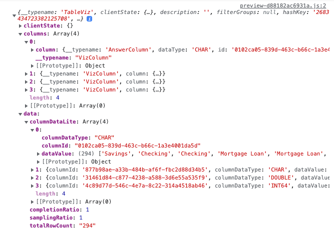

# Lesson 9 - Code Helpers

In the next two lessons we're going to be looking at handling custom actions and REST API calls.  The REST API requires making the correct call with the proper method and properties, which can be error-prone to get right the first time.  These APIs as well as custom actions return complex JSON data that needs to be parsed to use.  This lesson covers files that can help with common APIs and custom actions.

In particular, we'll look at two files located in the `src/apis` folder:  `rest-apis.js` and `dataclasses.js`.  

## Pre-Conditions

You can view these files in [GitHub](/src/apis), but ideally, you have downloaded a version of the code to inspect in your editor.

## rest-apis.js

The `rest-apis.js` file contains Javascript functions that make many common API queries, such as logging in, getting a list of liveboards a user can see, and making calls to the data APIs.  It's important to note that in order to use these functions, you need to have CORS enabled.  See [lesson 3](../lesson-03-security-setup/README-03.md) on setting up security for more details on setting up security.

IMPORTANT: API calls almost always require an active session.  If you are using these functions inside an SDK application, it will use the authentication you set up in the `init` method.

The top of the file has some helper functions to deal with arrays and make sure URLs used in the API calls are "clean".  The rest of the file contains functions for specific calls.  Let's take a look at `getPinboardList()` to see how one of these functions work.  (This is an older name, and should probably be renamed to `getLiveboardList`.)  This function returns a list of liveboards that the authenticated user has access to.

~~~
/**
 * Returns a list of pinboards that the user has access to.
 * Example:
   getPinboardList(tsurl).then(json, {
     // do something with the list.
   });
 * @param tsurl The URL for the ThoughtSpot cluster.
 * @returns {Promise<any>}  A promise with the list.
 */
export const getPinboardList = async (tsurl) => {
  // Returns the list of pinboards so the user can display them.
  const pinboardMetadataListURL = cleanURL(tsurl) + "/callosum/v1/tspublic/v1/metadata/listobjectheaders?" +
    "type=PINBOARD_ANSWER_BOOK" +
    "&batchsize=-1";

  return await fetch(
    pinboardMetadataListURL, {
      method: 'GET',
      headers: {
        "Accept": "application/json",
        "X-Requested-By": "ThoughtSpot"
      },
      credentials: "include"
    })
    .then(response =>  response.json())
    .then(data => data)
    .catch(error => {
      console.error("Unable to get the pinboard list: " + error)
    });
}
~~~

Most of the functions have a comment section prior that describe the parameters along with an example of using the function.  The examples can usually just be copied into your code and then modified.  

Next, most of the functions are `async`, meaning they return a Javascript promise.  That's why the example has the response code in the `.then()` block.  The calling code has to wait for the response to complete.  You can make this a synchronous call by using `await`, but that's up to you.

The first section of code creates the URL based on the parameters.  In this case, only the TS URL is required. Other functions will require specific parameters.  

Finally, the call to the API is made and the results (in this case a `promise`) is returned.  This code is useful because you have to get the method, headers, and format correct to get the call to work.  Many people have had challenges with the exact call details, so this code can help avoid those types of issues and wasted time.

You can review the other functions to see what's available.  You can create your own calls to other APIs using the same format.  

## dataclasses.js

The `dataclasses.js` file helps with handling some of the more complex JSON objects that can be returned by API calls or custom actions.  The data often has commonality, such as rows of data for custom actions, but the format is different and in many cases columnar instead of tabular.  

Similar to the `rest-apis.js` file discussed above, the first few functions are helpers for the rest of the calls.  They handle common things like sorting data that need to be used by multiple functions.

### Tabular Data

The next class `TabularData` is a base class for many of the data classes.  It allows you to use the different data content as a table, which is what is typically wanted when using custom actions and the data APIs.  The first few methods (e.g. `columnNames`, `numberRows`, `numberColums`) provide accessor methods to get common attributes.  You also notice the `set` methods here.  Typically, you would _not_ want to call these.

The next two methods, `populateDataByRow` and `populateDataByColumn` are used by the child classes to populate the data.  Two methods are needed because the APIs return the data in different structures. These functions will normalize the data to a common tabular structure.

Finally, there is a `getDataAsTable` method that will return the data as a table, i.e. a list of lists.  

As a user of this class (indirectly via the children), you typically only need to worry about the following:

* `columnNames` - returns a list of the column names in the same order that the table columns will be in.
* `nbrColumns` - returns the number of columns in the data.
* `nbrRows` - returns the number of rows in the data.
* `getDataAsTable` - returns the data as a table.

### Custom Action Classes

The next section of classes are for handling custom action data.  It's important to understand that each custom action will return data in a slightly different format.  So you have to use the correct class.  For example, the data from an action that isn't a context action in search is different from data in a liveboard.  The comments describe where each class is used.  

To see the level of complexity in the JSON, look at the following from a custom action that was triggered on a search.  If you were to handle this JSON directly, you'd likely have to access the columns, the data, parse them, and then combine them together.   These classes do that complex handling for you.

To understand the common structure of these classes, look at the ActionData class.  I've taken out the details of the processing for conciseness.  See the [dataclass.js](/src/apis/dataclasses.js) for details.  

As you can see, the class is very simple.  It extends the `TabularData` class to provide the methods described about.  Then, there is a static creator class that will create an object based on the JSON that was sent from the custom action.  The code will process the JSON to extract the columns of data and then call the `populateDataByColumn` method.  But you don't have to worry about any of that.  Once you get the ActionData object back, you can use it like all the other TabularData class.    

~~~
/**
 * This class handles data from Search and Answers where the action was from the main menu or main action.
 * It does not work for liveboard visualizations or context menus.
 */
export class ActionData extends TabularData {

  static createFromJSON(jsonData) {
    // code omitted for brevity
  }
}

~~~

### Data API 

The data APIs, liveboard and search, also return complex JSON that you usually want to use in tabular format.  To handle the process, there are `LiveboardData` and `SearchData` classes, both of which extend the `TabularData` class.  `LiveboardData` is used for data returns from the [LiveboardData](https://developers.thoughtspot.com/docs/?pageid=rest-api-reference#_liveboard_data) API call.  The `SearchData` class is used for data returned from the [SearchData](https://developers.thoughtspot.com/docs/?pageid=rest-api-reference#_search_data) API call.  

### Additional Helper Functions

The last two functions in this file help work with the tabular data.  

* `TabularDataToHtml` will convert the `TabularData` object to an HTML table, making it easy to insert into a web page.  Note that it has class names for the different attributes making it easy to style as well.
* `TabularDataToCsv` will convert the `TabularData` object to a CSV formatted content that you can save to a file or display.  

## Activities

1. Look at the different functions available in the [rest-api.js](/src/apis/rest-api.js) file.
2. Look at the different classes and functions available in the [dataclasses.js](/src/apis/dataclasses.js) file.
3. Use the Developer Playground to generate different custom actions and look at their payload.
4. Use the REST API playground to call LiveboardData and SearchData and look at the results from each.

## Files changed

* None

[< prev](../lesson-07-embed-full-app/README-07.md)
