# Lesson 10 - Custom Action

In this lesson we're going to take a look at how you can combine a custom action with the visual embed SDK to add custom capabilities to ThoughtSpot.  We'll first embed a geo visualization from a liveboard.  Then we'll add a context action to pop up a detailed view of data for a given data point (a US State in this case).  This final results will look like the following:

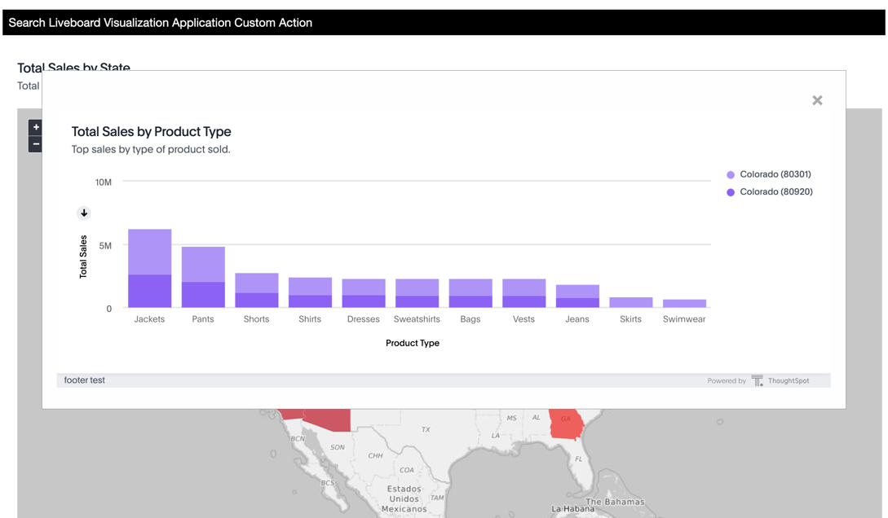

## Pre-Conditions

For this scenario, you will need to have the ability to create a liveboard and to create and add custom actions.  This means you need to be able to log in as a developer or admin with at least one worksheet you can use to create a liveboard.

## Create the liveboard

For this example, we are going to use a liveboard that has a map with data for US states and a more detailed list of products sold by state.  You can use any liveboard with two visualizations for this exercise, but you need to make sure the second liveboard (products sold) includes the attribute from the first (state).

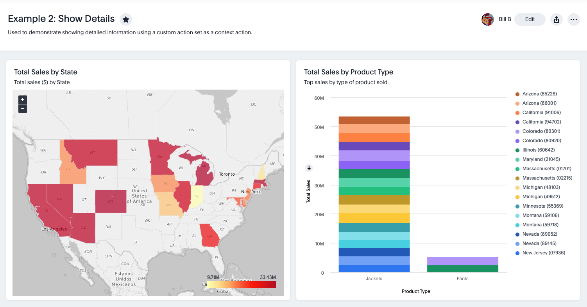

## Create the custom action
_If you have a callback action already created, you can skip this step._

Now that we have a liveboard to embed, we need to create our custom action to use.  Actions are created from the Developer Tab under the Customizations section.  

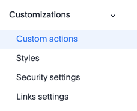

The action in this case is pretty simple.  Just create a callback action with a name and ID.  If needed, you can also limit which groups have access by clicking on the "Show advanced availability settings" link and selecting the groups.

You _could_ leave the "On by default for all visualizations" box checked, but typically you want to uncheck that box.  If it's checked this action will show up on all embedded content, which is usually not desired.  

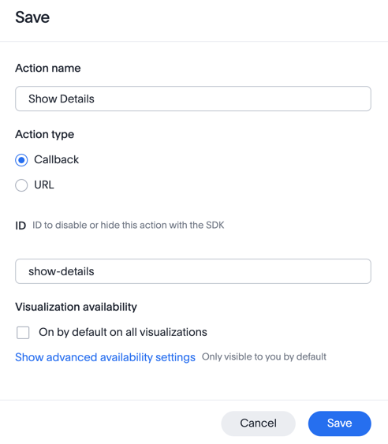

## Assign the custom action

Next, we need to add the action to the liveboard.  In our case, we want it to be set up as a custom action.  

First, edit the State (primary) visualization and open the actions' menu (the blue lightening bolt).  You can see here that any other actions are already shown.  In this case, there is a worksheet action that is included based on the search.  You can ignore those for now.

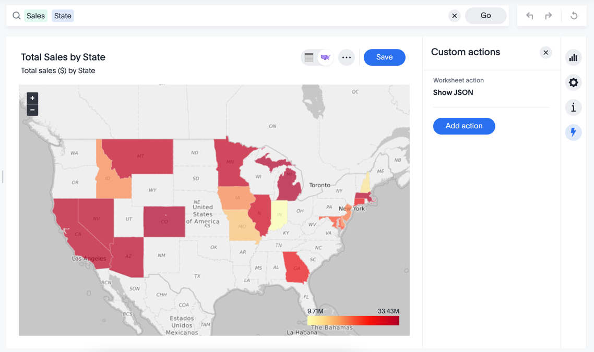

Next, click the "Add action" button, select the "Show Details" action, and then select the "Context Menu" option.  This will cause the action to show on the context (right-click) menu for this visualization only.  

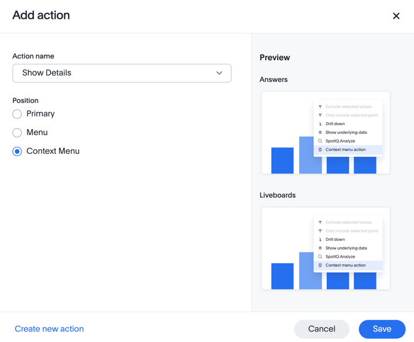

## Test the action

Before we start embedding, let's test that our custom action is properly configured.  You can't just right-click on the chart in the liveboard because callback actions only show up in embedded scenarios.  However, you can test it out in the Developer Playground.

Open the Developer Playground for visual SDK, select Visualization from the dropdown, and then select the specific liveboard to embed.  Once that show up, you can select the primary visualization.  Now if you click on a data point (a State in the example), you should see the "Show Details" action show up as shown in the following image:

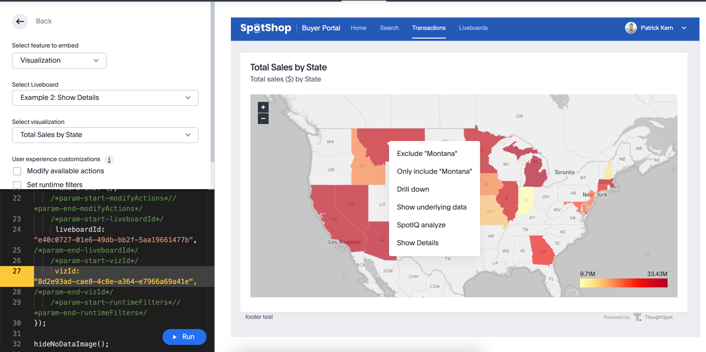

You might notice that we get a lot of other actions.  Let's go ahead and limit to just showing the "Show Details" action.  You do this by clicking the "Modify available actions" and then adding "show-details" to the list of `visibleActions`.  Note that you'll need to comment out the `hiddenActions`.  If you run the code now and right-click a point, you should only see one action.

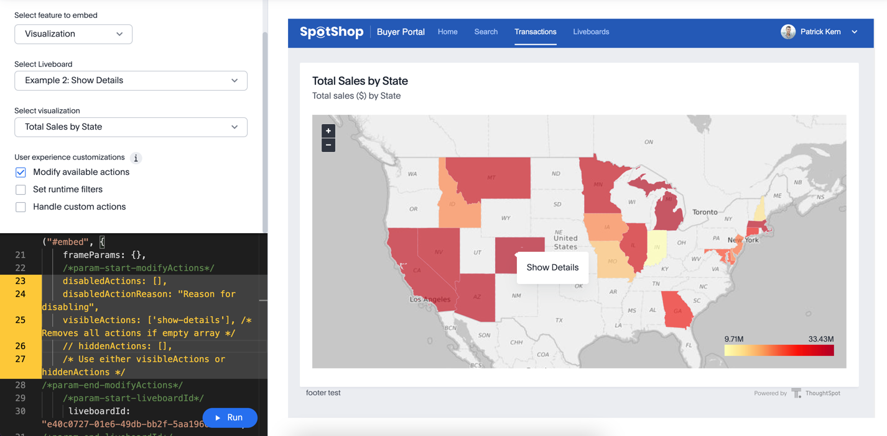

Finally, lets add a custom action handler to handle when the action is selected.  All custom actions respond to `EmbedEvent.CustomAction`.  When we get the event, we'll check the id of the action to make sure it's the one we want and handle it appropriately.  Check the box to "Handle custom actions" and you should get a block of code added.  You should edit the new code to use the "show-details" id.  Your event handler should look like the following:

~~~
.on(EmbedEvent.CustomAction, payload => {
  if (payload.id === 'show-details') {
    console.log('Custom Action event:', payload.data);
  }
})
~~~

If you run the code again and right-click on a data point (colored State) and then click the "Show Details" action, you should see a message come out in the console like the following.  Don't worry about the details of the message just yet.  

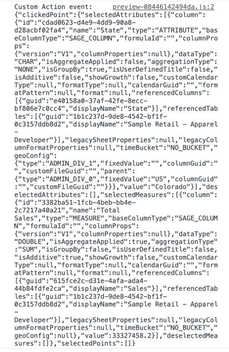

The complete code for the LiveboardEmbed looks like the following.  Note that your IDs will be different.

~~~
const embed = new LiveboardEmbed("#embed", {
    frameParams: {},
    /*param-start-modifyActions*/
    disabledActions: [],
    disabledActionReason: "Reason for disabling",
    visibleActions: ['show-details'], /* Removes all actions if empty array */
    // hiddenActions: [],
    /* Use either visibleActions or hiddenActions */
    /*param-end-modifyActions*/
    /*param-start-liveboardId*/
    liveboardId: "e40c0727-01e6-49db-bb2f-5aa19661477b",
    /*param-end-liveboardId*/
    /*param-start-vizId*/
    vizId: "8d2e93ad-cae8-4c8e-a364-e7966a69a41e",
    /*param-end-vizId*/
    /*param-start-runtimeFilters*//*param-end-runtimeFilters*/
});

hideNoDataImage();

embed
    // Register event listeners
    .on(EmbedEvent.Init, showLoader)
    .on(EmbedEvent.Load, hideLoader)
    .on(EmbedEvent.AuthExpire, showAuthExpired)
    /*param-start-customActionHandle*/
     .on(EmbedEvent.CustomAction, payload => {
          if (payload.id === 'show-details') {
               console.log('Custom Action event:', payload.data);
          }
     })
    /*param-end-customActionHandle*/
    .on(EmbedEvent.Error, () => {
        showNoDataImage();
        hideLoader();
    })
    // Render a viz within a liveboard
    .render();
~~~

Don't delete this code just yet or navigate away.  We can copy/paste the code into our application in the next step.

## Add the link for embedding

Before modifying the code, make sure your HTTP server is running.  If you shut it down previously, navigate to the source folder and run `python -m http.server 8000` or use the web server you used in previous lessons.  Now open the web server and view the application.  You should see the application like the following if you've done the previous lessons.  If you need a refresher on configuration, refer back to [lessons 4](/lesson-04-start-coding/README-04.md).

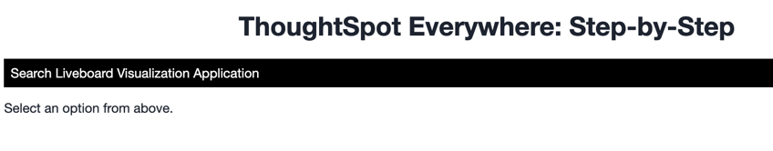

We first want to add a new link for the custom action example.  In `index.html` add a link to the `nav-links` section.  You should have something like the following:

~~~

    <ul id="ul-nav-links">
      <li id="search-link">Search</li>
      <li id="liveboard-link">Liveboard</li>
      <li id="visualization-link">Visualization</li>
      <li id="application-link">Application</li>
      <li id="custom-action-link">Custom Action</li>
    </ul>

~~~

Now in the `tse.js` file, add a handler for clicks on the link.   This is added with the other link handlers.

`document.getElementById('custom-action-link').addEventListener('click', onCustomAction);`

Finally, add the event handler function just below onApplication().

~~~
const onCustomAction = () => {

}
~~~

If you refresh the application (with the cache disabled), you should see the new screen like the following.  If you click the custom action, it doesn't do anything yet, but you also shouldn't get an error.

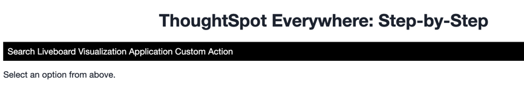

## Embed the primary visualization

Now we need to embed the primary visualization.  In this case, we'll add the state visualization based on the code above.  First, copy and paste the code for creating the visualization from the playground into the `onCustomAction()` function.  You can go ahead and remove any unwanted comments and code.  You should end up with something like the following.  

~~~
const embed = new LiveboardEmbed("#embed", {
    disabledActions: [],
    disabledActionReason: "Reason for disabling",
    visibleActions: ['show-details'], /* Removes all actions if empty array */
    liveboardId: "e40c0727-01e6-49db-bb2f-5aa19661477b",
    vizId: "8d2e93ad-cae8-4c8e-a364-e7966a69a41e",
});
~~~

Now add the render(), but make sure to include the custom action handler.  You will need to remove addition code generated by the playground.  The tidied code should look like the following:

~~~
embed
     .on(EmbedEvent.CustomAction, payload => {
          if (payload.id === 'show-details') {
               console.log('Custom Action event:', payload.data);
          }
     })
    .render();
~~~

Note that we are still just logging the custom action, but that will verify this part of the code is working.  The final `onCustomAction` should look like the following:

~~~
const onCustomAction = () => {
  const embed = new LiveboardEmbed("#embed", {
    disabledActions: [],
    disabledActionReason: "Reason for disabling",
    visibleActions: ['show-details'], /* Removes all actions if empty array */
    liveboardId: "e40c0727-01e6-49db-bb2f-5aa19661477b",
    vizId: "8d2e93ad-cae8-4c8e-a364-e7966a69a41e",
  });
  embed
       .on(EmbedEvent.CustomAction, payload => {
            if (payload.id === 'show-details') {
                 console.log('Custom Action event:', payload.data);
            }
       })
      .render();
}
~~~

In this code, we reference EmbedEvent, so we need to add that to the import statement.  Once we add it, the import looks like the following:

~~~
import {
  init,
  AuthType,
  SearchEmbed,
  LiveboardEmbed,
  AppEmbed,
  Page,
  Action,
  EmbedEvent,
} from 'https://unpkg.com/@thoughtspot/visual-embed-sdk/dist/tsembed.es.js';
~~~

Now if you refresh the application and select Custom Action from the links, you should see the State image load.  Right click and you get the single custom action.  If you click the action, you should see the details in the console.  

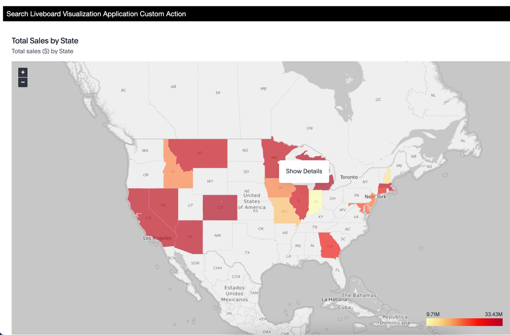

## Add the custom action handler

Rather than log the contents, we now want to show the popup with the detailed view. In the `index.html` file, you'll see the following code prior to the nav links section.  This code provides a section that we'll show and hide using CSS.

~~~

  

    &times;
    

  

~~~

The two important lines here are the `` that shows an `x` that we'll use to close the modal and the `
` where we'll add show the embedded content.  If you look at the tse.css file, you'll find styles for all the model content and close button.  We won't go into details on CSS in this course.  

Since we are going to use a liveboard visualization as the popup, we can use the playground to generate our embedded visualization.  This demonstrates how the playground can quickly generate code for a variety of uses.  Let's first add a function to call to show the details.  Add a new function called `showDetails` after the `onCustomAction` function like the following.  Note that it's going to receive the payload from the custom action to determine what details to display.

~~~
const showDetails = (payload) => {
}
~~~

In the playground, generate a liveboard visualization object that will display the details using detail visualization.  Limit the actions to only allow "drill down" (using visibleActions) and then add runtime filters, but clear the values.  Add this code and the render to the `showDetails` function.  You should now how something like the following after cleaning up unwanted code.  

_*IMPORTANT: you need to change the target ID for the embed content (first parameter) to make sure the popup doesn't just replace the current visualization.*_

~~~
  const embed = new LiveboardEmbed("#modal-data-content", {
    visibleActions: [Action.DrillDown], 
    liveboardId: "e40c0727-01e6-49db-bb2f-5aa19661477b",
    vizId: "96db6db8-662a-45b5-bc70-00341d75846b",
    runtimeFilters: [{
      columnName: '',
      operator: RuntimeFilterOp.EQ,
      values: ['']
    }],
  });

  embed.render();
~~~

Note that this adds a new type, `RuntimeFilterOp`, so add that to the import statement as well.  

Next, we need the details to show up when we select the custom action. First, we need to call this function when the custom action is triggered.  Replace the `console.log` in the `onCustomAction` with a call to `showDetails(payload)`.  Next, you need to show the modal after the call.  The following code can be called after `render()` in `showDetails`.  

~~~
const dataElement = document.getElementById('modal-content');
dataElement.style.display = 'block';
~~~

Now if you run the code and select the `Show Details` option, you should see a pop-up with the second visualization.  If you don't, then check the browser console for errors.  

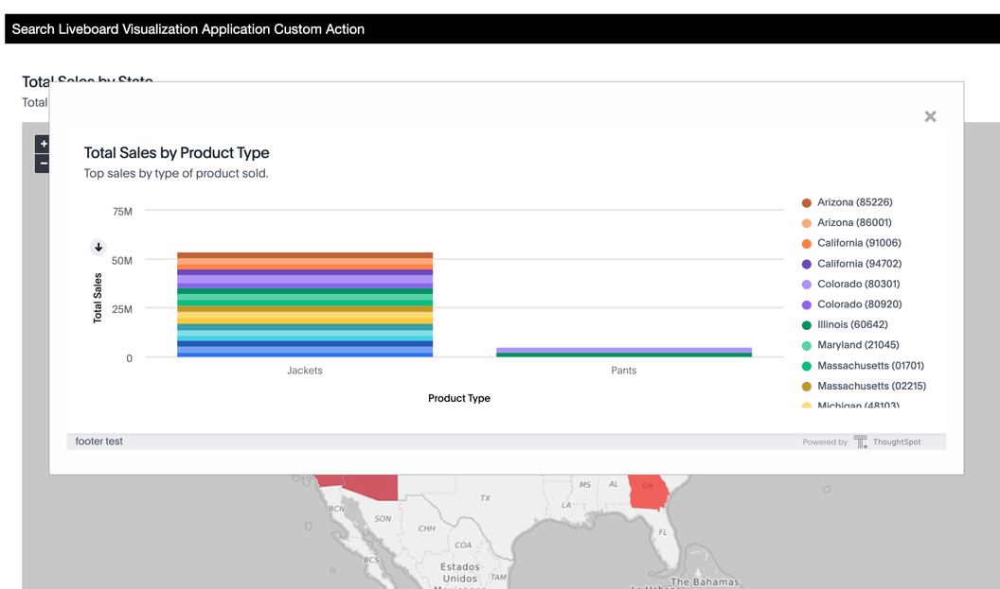

You'll note that the dialog isn't filtered, and we want to show the details for the specific state we clicked.  We can get this information from the payload that was passed.  Go ahead and click the `X` to close the dialog.  This code was already provided in the `tse.js` file using the `closeModal` function, which you can look at if desired.

### Filter the data

To filter the data we'll use the payload passed in from the custom action.  As you noticed earlier in the console, this is a very complex object.  In [lesson 9](/lesson-09-code-helpers/README-09.md) we reviewed the helper classes for these objects.  We're going to use the `LiveboardContextAction` class from that file for this example because this is context action in a liveboard visualization.  

Since this class is coming from a new file, you need to import first.  After the import for the SDK objects, add the following:

~~~
import { LiveboardContextActionData } from "./apis/dataclasses.js";
~~~

In the `showDetails` function, add the following lines of code at the top.  This code converts the payload to the LiveboardContextData type and then extracts the first value.  Since this is a context action, it should only have one value that is a state and the sales.  We simply want the name of the data, which is the first column.  

~~~
const liveboardContextData = LiveboardContextActionData.createFromJSON(payload);
// Only gets the first column value.
const filter = liveboardContextData.data[liveboardContextData.columnNames[0]];
~~~

Now that we have the filter value, we can update the runtime filters to specify the column is "state" and the value is our filter.  The `runtimeFilters` now looks like this:

~~~
runtimeFilters: [{
  columnName: 'state', 
  operator: RuntimeFilterOp.EQ,
  values: [filter] 
}],
~~~

Now run the code again to verify the filter is applied, and you only see the state details.  Check the console for errors if you don't get this visualization.

## Complete functions

The following show the new functions we added to our code.  You can also find the changes in the src sub-folder.

~~~
const onCustomAction = () => {
  const embed = new LiveboardEmbed("#embed", {
    disabledActions: [],
    disabledActionReason: "Reason for disabling",
    visibleActions: ['show-details'], /* Removes all actions if empty array */
    liveboardId: "e40c0727-01e6-49db-bb2f-5aa19661477b",
    vizId: "8d2e93ad-cae8-4c8e-a364-e7966a69a41e",
  });
  embed
       .on(EmbedEvent.CustomAction, payload => {
            if (payload.id === 'show-details') {
                 showDetails(payload)
            }
       })
      .render();
}

const showDetails = (payload) => {
  const liveboardContextData = LiveboardContextActionData.createFromJSON(payload);
  // Only gets the first column value.
  const filter = liveboardContextData.data[liveboardContextData.columnNames[0]];

  const embed = new LiveboardEmbed("#modal-data-content", {
    visibleActions: [Action.DrillDown],
    liveboardId: "e40c0727-01e6-49db-bb2f-5aa19661477b",
    vizId: "96db6db8-662a-45b5-bc70-00341d75846b",
    runtimeFilters: [{
      columnName: 'state',
      operator: RuntimeFilterOp.EQ,
      values: [filter]
    }],
  });

  embed.render();

  const dataElement = document.getElementById('show-data');
  dataElement.style.display = 'block';
}
~~~

## Activities

1. Update index.html and tse.js to add the new links and handler.
2. Add the embedded visualization for the primary visualization.
3. Add the custom action handler to show a popup of the details.

## Files changed

* index.html
* tse.js

[< prev](../lesson-09-code-helpers/README-09.md)
