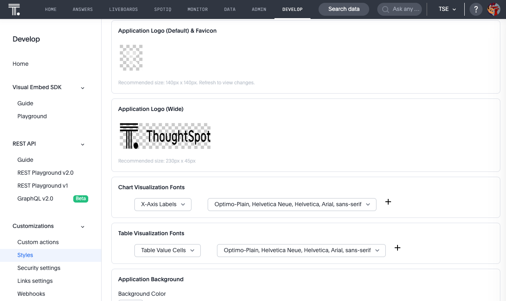
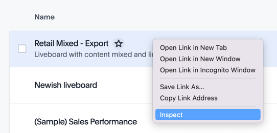
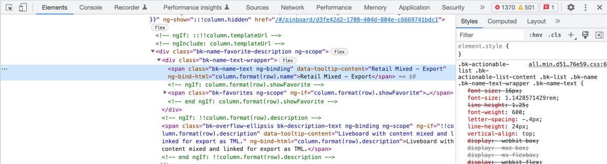
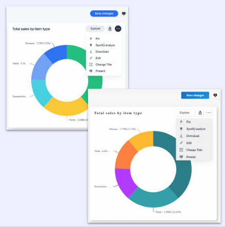
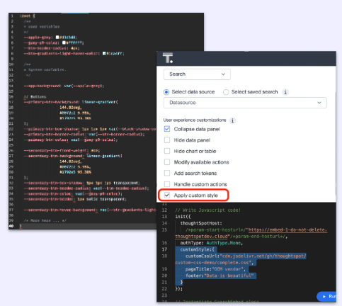

# Lesson 8 - Styling Embedded ThoughtSpot Content

Now that we've covered the primary ways you can embed ThoughtSpot, let's talk about how you can change the look and feel of the embedded content.  We aren't going to change the style as part of this lesson, but you should feel free to try it in your cluster if you desire.

We'll cover styling in three area:

1. What style you can apply in the current UI.
2. What custom style you can apply via a CSS file.
3. What's coming in the future for control of style.

## Pre-Conditions

You need to be logged in as a developer in ThoughtSpot to view the style page.

## Changing style in the UI

If you navigate to the `Develop -> Styles` page in ThoughtSpot you will see a form similar to the following.  It allows you to change a limited number of style options.   Commonly changed style items are:

* Change the top left logo and fav icon
* Change the color pallet of for charts
* Some limited font styles such as chart labels (but not other text like names and descriptions)
* Adding a footer for embedded text

Some of these changes should be well tested.  For example, you can change the background color of the navigation menu to any color you want, but not the foreground color.  So if you set it to a light color such as white or grey, users will have a hard time reading the text.  

See the [ThoughtSpot documentation](https://docs.thoughtspot.com/cloud/latest/style-customization) for more details about each setting.

## Using the customCssUrl setting

Ever since SDK version 1.6, embedding users have had the option to set the `customCssUrl` property and include a custom style sheet.  This style sheet will overwrite any default ThoughtSpot style, giving a very large degree of customization.  The flag is documented in the [developer documentation](https://developers.thoughtspot.com/docs/typedoc/interfaces/EmbedConfig.html#customCssUrl).

Before getting into the details of using the `customCssUrl` it's important to keep two thing in mind:
* This property isn't supported beyond allowing you to embed it into your application.  The only support options are via the ThoughtSpot community.
* ThoughtSpot can change the class names and element in new version.  That means a working style may stop working when a new release comes out.  This doesn't happen often, but is a risk.

For the reasons give above, this approach isn't generally recommended.  But it does exist and is available, so we want to talk about it as an option.  See below for upcoming functionality that will allow you more control over style in a supported manner.

### Creating the style sheet

The `customCssUrl` points to a standard CSS file that you can configure into any application.  You can find out more about CSS in general via online sources, such as the [W3 Schools site](https://www.w3schools.com/css/default.asp).  This lesson assumes you are familiar with CSS.

To set a style, you first have to find the style to apply.  There's no easy way to do this that is ThoughtSpot specific.  Typically, the easiest approach is to use the "elements" feature in Chrome or another browser.  

Selecting this option will open the element inspector with the element pre-selected and the styles being applied shown in the side browser (depending on your browser and settings).  You can now modify the settings in the browser in the `element.style` section to test how you can change to get the settings you want.

Once you have the settings you want, you can set the style in your style sheet, so it will override the default styles.  

### Referencing the customCssUrl

Now that you have the style sheet, you will need to deploy it to a location that's accessible to ThoughtSpot.  Usually, that means having cross-site scripting set on the target file such that ThoughtSpot URLs can access the file.  Within ThoughtSpot, you will also have to set the `style-src` to add the target file URL.  This setting requires a support ticket to change.

Finally, you will reference the customCssUrl in the `init` method.  For example:

~~~
init({
  thoughtSpotHost: tsURL,
  authType: AuthType.None,
  customCssUrl: 'https://myserver.com/css/mystyle.css'
});
~~~

Once you have everything in place, you should be able to refresh your app and see the changes.  Be sure to have caching disabled and look for errors in the console.  

## Upcoming features

The UI changes are limited and the `customCssUrl` comes with added risk and complexity, so neither are great solutions if you need to do detailed style customization.  To help with this challenge ThoughtSpot is working on an in-product, supported, flexible solution.  The solution hasn't been finalized yet, so the following is based on _expected_ features.

The image below shows how you will be able to use different fonts and styles for the buttons as examples.

The current plan is to provide an editor and support within the Developer's Playground to edit and test the style.  It's expected that this feature will be release in late 2022 or early 2023.  

## Activities

1. Look at the different options on the style settings page.
2. Review the [documentation](https://docs.thoughtspot.com/cloud/latest/style-customization) for style settings.  
3. If you like, create and use a custom CSS style sheet.

## Files changed

* None

[< prev](../lesson-09-embed-full-app/README-07.md) | [> next](../lesson-09-code-helpers/README-09.md)
