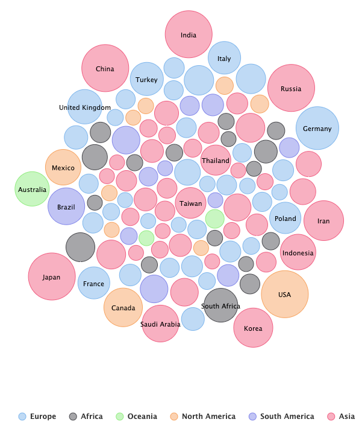
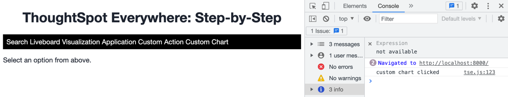
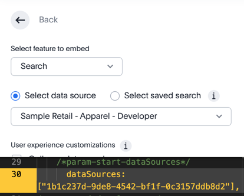
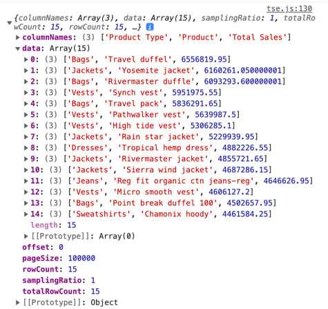
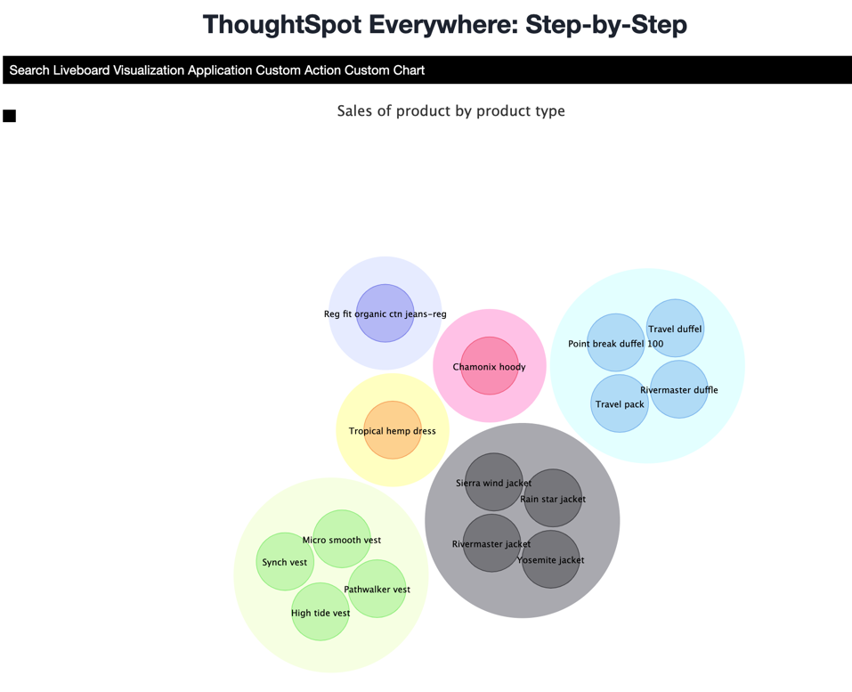

# Lesson 11 - Custom Charts

This lesson is the first of two that will use REST APIs to get more information from ThoughtSpot.  So far the integrations have mostly dealt with using the visual embed SDK.  But there are many scenarios where you want to get non-visual data from ThoughtSpot.  In this lesson we'll use the [SearchData API](https://developers.thoughtspot.com/docs/?pageid=search-data-api#search-data-api-ref) and get data via search and display a custom chart using HighCharts. 

## Pre-Conditions

For this lesson, you will need a worksheet with data that you can search. 

## Identify the chart to use

For this lab we are going to use the [packed bubble](https://www.highcharts.com/demo/packed-bubble) chart from [HighCharts](https://www.highcharts.com).  This chart packs a bunch of info into one view.  Colors are used for series, labels for data values, and sizes for magnitude.  They can get really busy and hard to read for large data results, but they have a fun, bouncing effect that make them great for exercises.

## Identify the search

Now that we have the chart, we need a search.  In this case, you can see that this chart works best for two attributes and a measure.  One attribute will be the data value (country in the example) and the second will be the series (color and legend in the example).  The measure will be used for the size.  We'll also show the values on a tool tip.

Since my example is using the retail data worksheet, I'm going to do a search by product type, product, and sales, and I'll limit the search to the top 15 values just to make it more readable when it renders. When using the SearchData API, you have to use a special [TML search format](https://developers.thoughtspot.com/docs/?pageid=search-data-api#_search_query).  The final search looks like: `[product] [product type] [sales] top 15`.  
## Add the link and function for the custom chart

First, add a link to the `index.html` file after the link for the Custom Action.  Your list of links should look like the following:

~~~
<ul id="ul-nav-links">
  <li id="search-link">Search</li>
  <li id="liveboard-link">Liveboard</li>
  <li id="visualization-link">Visualization</li>
  <li id="application-link">Application</li>
  <li id="custom-action-link">Custom Action</li>
  <li id="custom-chart-link">Custom Chart</li>
</ul>
~~~

Now, in `tse.js` add an empty function after the `showDetails` function:

~~~
const onCustomChart = () => {
  console.log('custom chart clicked');
}
~~~

Finally, add the event listener so the custom chart will be created when the `Custom Chart` link is clicked.

`document.getElementById('custom-chart-link').addEventListener('click', onCustomChart);`

Go ahead and refresh the application (start the server if needed) and verify that the link shows up.  Click the link and check the console to make sure the link clicked message shows.

## Execute the search

The search can be executed using the [SearchData API](https://developers.thoughtspot.com/docs/?pageid=search-data-api#search-data-api-ref).  You can create the call yourself, but it's already included in the [rest-api.js](/src/apis/rest-api.js) file that we discussed in [lesson 9](/lesson-09-code-helpers/README-09.md).  We'll use this function in this lesson to get the data.

First, we need to import the `getSearchData()` function from the `rest-apis.js` file.  Under the previous imports (at the top) add the following line of code:

`import { getSearchData } from "./apis/rest-api.js";`

Now update the `onCustomChart()` method update the code to look like the following:

~~~
const onCustomChart = () => {
  console.log('custom chart clicked');
  
  const worksheetID = "1b1c237d-9de8-4542-bf1f-0c3157ddb8d2";  // Worksheet GUID
  const search = "[sales] [product type] [product] top 15";  // Search string

  getSearchData(tsURL, worksheetID, search).then(data => {  // call from rest-api.js
    console.log(data);
  })
}
~~~

Let's walk through the parts of the code.  The `worksheetID` is the unique ID for the worksheet we are going to use.  We could also use a table or view, but worksheets are usually best as the data source for queries.  You can figure out this GUID by opening the playground, selecting Search, and then picking the data source.  The code will embed the GUID that you can simply copy and paste.

The next line defines the search to send to the worksheet.  It is in the [TML format](https://developers.thoughtspot.com/docs/?pageid=search-data-api#components) used for this API and embedding Search.  In this case we are getting the sales and products and their type, but only the top 15 (by sales).  

Next, we execute the search data API using the function in the `rest-api.js` file.  This call takes three parameters: the URL for ThoughtSpot, the data source (worksheet) and the search string (in TML format).

The call will return a Javascript Promise, so we have to wait for the return using `then()`.  The data is returned as a JSON blob of data.  If you run the code now and click on `Custom Chart` you should get a log message with the data returned.  Check for errors if you don't.

For the chart we'll need the column names and the data.

## Render the chart

Now that we have the data, we just need to render a chart.  We already have the necessary imports in the `index.html` file:

~~~

~~~

First we need to get the data into a format that will be useful for HighCharts to render.  This code is a little complex, but we'll walk through each of the parts.  Add the following _inside_ the `.then()` (after the console.log statement).

~~~
// Get the indexes of the columns in the data.
const salesIdx = data.columnNames.findIndex(v => v == 'Total Sales');
const productTypeIdx = data.columnNames.findIndex(v => v == 'Product Type');
const productIdx = data.columnNames.findIndex(v => v == 'Product');

// convert the resulting data to the series for the HighChart.  Format is:
// [
//   { name: '<product type>', data: [{ name: <product>, value: <sales> }, ... ]}
//   { name: '<product type>', data: [{ name: <product>, value: <sales> }, ... ]}
// ]

const series = {}
for (const r of data.data) {
  const productType = r[productTypeIdx]
  if (! Object.keys(series).includes(productType)) {
    series[productType] = []
  }
  // Combines all the data items to the key for each series.
  series[productType].push({ name: r[productIdx], value: r[salesIdx]/1000});
}

// Now need to as the chart series.
const chartSeries = []
for (const productType of Object.keys(series)) {
  chartSeries.push({name: productType, data: series[productType]})
}
~~~

The first three lines, `const xxxIdx` determine the index of the column for the given values.  This is important, so we can align the columns with the data.  They data and the columns are in the same order, but they may not be in the order of the query.  The other thing to be aware of is that the column names in the results _don't_ always match the names in the worksheet.  In particular the measure names can be different.  In this case we are getting `Total Sales`.  

Next we need to convert the data to the series struction that is expected by HighCharts.  The code first gets the data into a preliminary format for the series object.  Note that the value of the sales is divided by 1000.  This is just for display since the numbers here are large.  

Finally, we convert the data structure to the HighCharts series format as described in the comments.  

The last step is to create the chart.  Add the following code to after the series creation.  The majority of the code are attributes for HighCharts.  See the [HighCharts documentation](https://www.highcharts.com/demo/packed-bubble) for the available settings and format.  

~~~
// Render the chart.
Highcharts.chart('embed', {
  chart: {
    type: 'packedbubble'
    /* height: '80%'*/
  },
  title: {
    text: 'Sales of product by product type'
  },
  tooltip: {
    useHTML: true,
    pointFormat: '<b>{point.name}:</b> ${point.value:.1f}M'
  },
  plotOptions: {
    packedbubble: {
      minSize: '20%',
      maxSize: '40%',
      zMin: 0,
      zMax: 1000,
      layoutAlgorithm: {
        gravitationalConstant: 0.05,
        splitSeries: true,
        seriesInteraction: false,
        dragBetweenSeries: true,
        parentNodeLimit: true
      },
      dataLabels: {
        enabled: true,
        format: '{point.name}',
        filter: {
          property: 'y',
          operator: '>',
          value: 250
        },
        style: {
          color: 'black',
          textOutline: 'none',
          fontWeight: 'normal'
        }
      }
    }
  },
  series: chartSeries
});
~~~

See the [tse.js](src/tse.js) file for the final version with all the updates.

Now run refresh in the browser and click on `Custom Charts`.  You should see something like the following:

## Activities

1. Update index.html and tse.js to add the new links and handler.
2. Add the code to generate the search.
3. Render the custom chart from the search data.

## Files changed

* index.html
* tse.js

[< prev](../lesson-10-custom-action/README-10.md)
