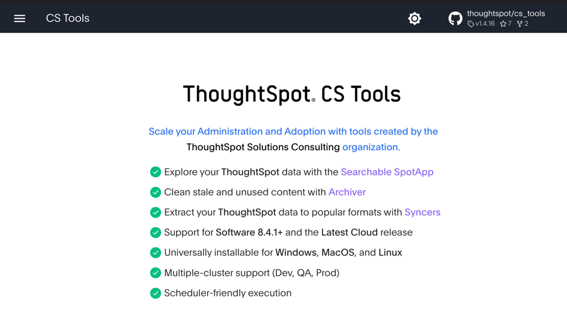

# Course Summary

In this course we covered a lot of topics related to embedding ThoughtSpot into your own applications to give the analytics power to the end users.  We covered the high-level concepts such as setup and security, as well as doing detailed implementations of the different types of embedding.  

We hope you enjoyed this course and learned a lot.  TSE is an area of key focus for ThoughtSpot, and we continue to add additional capabilities to give you even more control.  You can expect to see updates on a regular (approximately monthly) basis.  

# Additional Topics

This course focused on embedding ThoughtSpot visualizations and responding to user actions.  Additional topics you may want to explore that weren't covered here are:

* Custom styling, i.e. making ThoughtSpot more closely match your style.
* Bidirectional events to identify when things occur in ThoughtSpot and programmatically control TS.  
* URL custom actions.
* Sync.
* Additional APIs for metadata and user management.
* CS Tools.

We won't go into detail on these topics here, but it's useful to do a quick review of each along with pointers to documentation.  Be on the lookout for future articles, examples, and training.  This information is current as-of 8.8.0.cl, so if you are looking later, many of the upcoming features may be released already.

## Custom Styling

It's often the case that you want to have the ThoughtSpot style more closely match your application style.  ThoughtSpot has controls [built-in](https://docs.thoughtspot.com/cloud/latest/style-customization) to modify the style of some items, such as the icons and fonts on charts.  That's pretty limited.  There is also the capability to add a [custom style sheet](https://developers.thoughtspot.com/docs/typedoc/interfaces/EmbedConfig.html#customCssUrl) to modify styles.  This capability gives you much more control, but does cary some risk because the IDs and classes can change.

Coming soon you will have the ability to specify a custom CSS file that uses know and supported classes and IDs.  Additionally, you'll be able to specify specific style details in the `init()`.

## Bidirectional Events

Custom Actions are a sub-category of `EmbedEvent`.  There are over 40 [embed events](https://developers.thoughtspot.com/docs/typedoc/enums/EmbedEvent.html) (with more coming) that you can respond to.  These include things like the search changing, data being retried, visualizations being shown, etc.  It gives you an opportunity to monitor and respond to these events.

ThoughtSpot also has over 20 [HostEvents](https://developers.thoughtspot.com/docs/typedoc/enums/HostEvent.html) that allow you to trigger actions in the embedded ThoughtSpot.  These events include setting runtime filters, drilling down, etc.  

## Sync

As of ThoughtSpot 8.7.0, there is a capability to [sync](https://docs.thoughtspot.com/cloud/latest/thoughtspot-sync) data to targets.  This can include applications, such as Slack or Teams as well as data formats, such as Google Sheets and Salesforce.  These are similar to CustomActions without the need to write any code. 

## Addition APIs

In this course we covered a few API calls, mainly to retrieve data.  But ThoughtSpot has a [variety of REST API endpoints](https://developers.thoughtspot.com/docs/?pageid=rest-api-reference) that allow you to retrieve metadata, such as lists of content, manage objects, and manage users and groups.  These APIs allow you to add custom navigation and more tightly integrate the operations of ThoughtSpot into your application. 

## CS Tools

[CS Tools](https://thoughtspot.github.io/cs_tools) is not technically part of ThoughtSpot Embedded.  But it's useful enough to mention here.  CS Tools is a community supported set of open source tools that allow you to do things like extract usage information, automate TML activities, and more easily manage users, etc.  See the [list of tools](https://thoughtspot.github.io/cs_tools/cs-tools/overview/) for the current capabilities.  And if you are interested, you can even contribute ideas and code.  

# Next Steps

## Join Community

If you haven't already, I highly recommend joining the [ThoughtSpot community](https://community.thoughtspot.com).  Here you'll find knowledge articles on an ever expanding set of topics from embedding specific, to security and usage.  You'll also have the chance to ask questions and get responses from ThoughtSpot employees as well as partners and other customers who are doing similar things.  It's also where you enter support tickets and made feature recommendations.  Finally, we post about upcoming events and important activities.  It's a great place to get connected and stay informed.

## Developers Portal

The [Developers Portal](https://developers.thoughtspot.com) is the site where customers and non-customers alike can find information about ThoughtSpot.  In particular, you'll find [CodeSpot](https://developers.thoughtspot.com/codespot) on the Developer's portal that has code examples showing how to do different things as well as downloadable examples.  It's another great place to stay informed and involved.

[< prev](../lesson-11-custom-charts/README-11.md)
